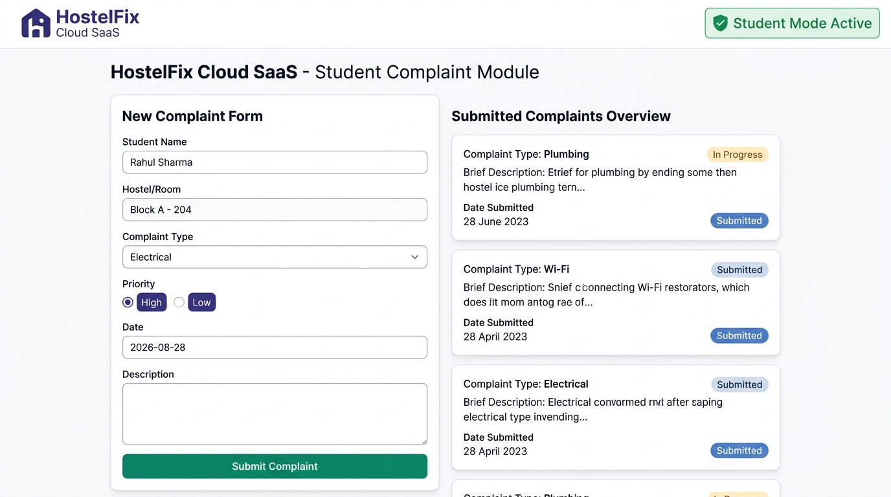
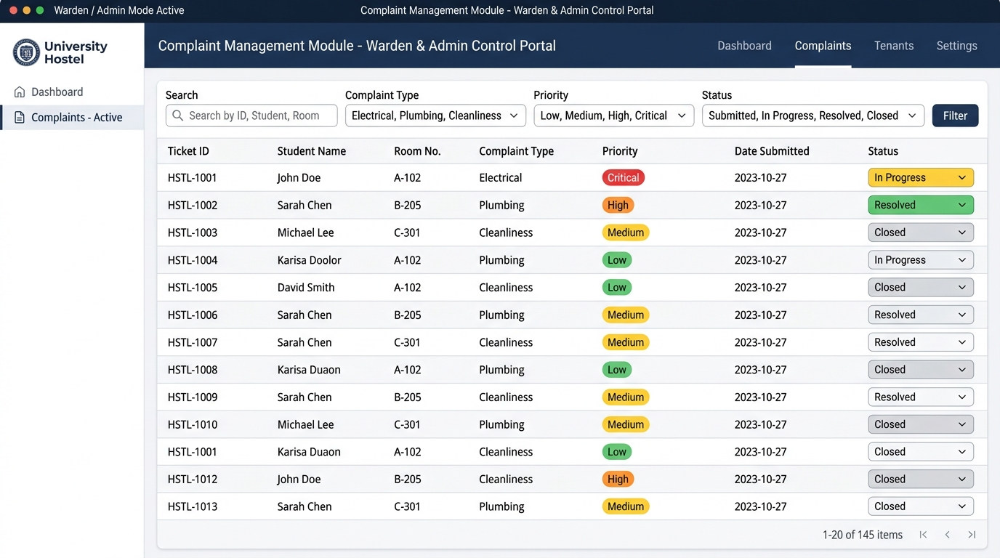
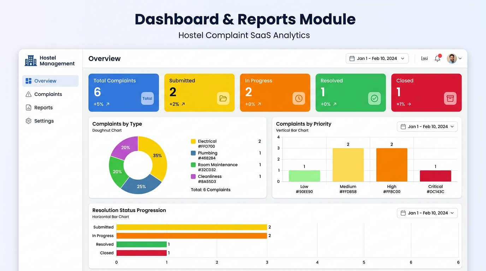
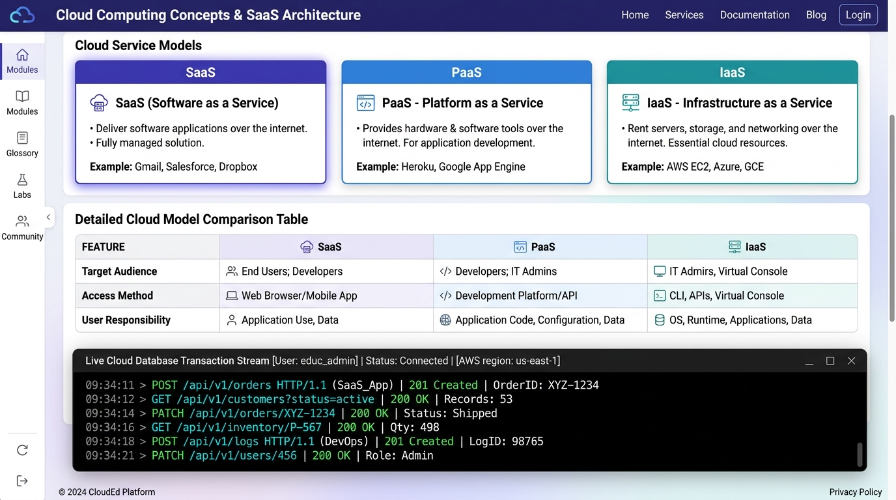

# Cloud-Based Hostel Complaint Management System 🏢⚡

[](https://github.com/saimohith-24/Cloud_CSA1516/tree/main/Assignment)
[-blue.svg)](https://github.com/saimohith-24/Cloud_CSA1516)
[](LICENSE)

A simple, modern, and feature-rich **Software as a Service (SaaS)** web application built for college hostel complaint management. Developed for the **Cloud Computing (CSA1516)** assignment submission and viva demonstration.

---

## 🎯 Project Overview & Goal

The **Cloud-Based Hostel Complaint Management System** demonstrates how cloud computing software models (specifically **SaaS**) streamline campus administration. It eliminates slow, error-prone paper register logs by providing a centralized web portal where:
- **Students** submit, track, and search hostel complaints in real time.
- **Wardens & Admins** review all complaints, filter by priority or category, update resolution statuses, and view graphical analytical reports.

---

## 🚀 Key Features

- **🎓 Student Complaint Module:** Simple form capturing Student Name/ID, Hostel/Room Number, Complaint Category, Description, Date, and Priority. Includes real-time personal submission search.
- **👨‍🏫 Complaint Management Module (Warden/Admin View):** Interactive data grid featuring multi-criteria search, filters (Type, Priority, Status), and live status update controls (`Submitted` → `In Progress` → `Resolved` → `Closed`).
- **📊 Real-Time Dashboard & Visual Reports:** Interactive charts powered by Chart.js:
  - *Metric Summary Cards:* Total Complaints, Submitted, In Progress, Resolved, Closed.
  - *Complaints by Type:* Doughnut distribution chart.
  - *Complaints by Priority:* Urgency bar chart.
  - *Status Lifecycle:* Horizontal progression bar chart.
- **🔐 User Role Switcher:** Instant role-toggle between **Student Mode** and **Warden/Admin Mode** for seamless viva demonstration.
- **☁️ Cloud DB & Live Stream Simulator:** Persistent Local Storage cloud sync with live transaction logs simulating REST API operations (`POST`, `PATCH`, `GET`).
- **📥 Data Export & Reset:** One-click JSON data export and instant Viva sample data restoration button.

---

## 🛠️ Technologies Used

| Layer | Technology / Library |
| :--- | :--- |
| **Frontend UI** | HTML5, Modern CSS3 (Glassmorphism, CSS Variables, Responsive Grid) |
| **Icons & Fonts** | FontAwesome 6.4.0, Google Fonts (*Inter*, *Outfit*) |
| **Client Scripting** | Vanilla JavaScript (ES6 Modules) |
| **Data Analytics** | Chart.js 4.x (via CDN) |
| **Cloud Persistence** | Web Storage API (Local Storage Cloud DB Sync Simulation) |

---

## 📑 Required Fields Summary

Every complaint record in the system contains all 7 mandatory fields:
1. **Student Name / ID** (`studentName`)
2. **Hostel / Room Number** (`roomNumber`)
3. **Complaint Type** (`complaintType`: *Electrical*, *Plumbing*, *Room Maintenance*, *Cleanliness*, *Other*)
4. **Complaint Description** (`description`)
5. **Date** (`date`)
6. **Priority** (`priority`: *Low*, *Medium*, *High*, *Critical*)
7. **Status** (`status`: *Submitted*, *In Progress*, *Resolved*, *Closed*)

---

## 📸 Screenshots Section

### 1. Student Complaint Module


### 2. Warden Complaint Management Module


### 3. Dashboard Analytics & Reports Module


### 4. SaaS Architecture & Cloud Concepts Module


---

## 🏃 Quick Setup & Run Instructions

### Option 1: Direct Web Browser Launch (No Installation Required)
1. Clone or download the repository.
2. Navigate to the `Assignment` folder:
   ```bash
   cd Assignment
   ```
3. Open `index.html` directly in any web browser (Chrome, Firefox, Safari, Edge).

### Option 2: Run with Local HTTP Server
If using Node.js or Python:
```bash
# Using Python 3
python3 -m http.server 8085

# Or using npx serve
npx serve .
```
Then visit `http://localhost:8085` in your browser.

---

## ☁️ Cloud Computing & SaaS Concept Explanation

### What is Software as a Service (SaaS)?
**Software as a Service (SaaS)** is a cloud computing model where application software is hosted centrally in the cloud and accessed by end users via a standard web browser over the internet.

### Comparison of Cloud Service Models:

| Feature / Layer | IaaS (Infrastructure as a Service) | PaaS (Platform as a Service) | SaaS (Software as a Service) [THIS APP] |
| :--- | :--- | :--- | :--- |
| **Target Audience** | System Administrators | Software Developers | **End Users (Students & Wardens)** |
| **User Manages** | OS, Runtime, Applications, Data | Application Code & Data | **Nothing to install; uses Web App directly** |
| **Cloud Provider Manages** | Servers, Virtualization, Network | Runtime, OS, Scaling | **Full Application, Security, Storage, Server** |
| **Example Services** | AWS EC2, GCP Compute Engine | Firebase, Heroku, App Engine | **Hostel Fix SaaS App, Gmail, Google Workspace** |

---

## 🎓 Viva Presentation & Q&A Cheat Sheet

1. **Q: Why is this project called a SaaS application?**
   - *A:* Because users (students and wardens) do not install any software or manage servers. They access the complete application and database over the cloud via a web browser.
2. **Q: How does role-based access work in this project?**
   - *A:* The app features a role selector: **Student Mode** restricts access to form submission and personal complaint viewing, while **Warden Mode** enables administrative editing rights to update ticket status (`Submitted` → `In Progress` → `Resolved` → `Closed`).
3. **Q: Where is complaint data stored?**
   - *A:* Data is stored in centralized persistent JSON storage simulating a Cloud Database, with a live REST API transaction log feed.

---

## 📁 Repository Structure

```
Assignment/
├── index.html                  # Main Web Application Interface
├── styles.css                  # Modern CSS Design System & Theme
├── app.js                      # Application Logic, Role Controller & Chart Engine
├── README.md                   # Project Overview & Setup Guide
├── ASSIGNMENT_DOCUMENTATION.md # Complete 11-Section Academic Assignment Report
└── screenshots/                # Application Screenshots
    ├── student_module.png
    ├── warden_management.png
    ├── dashboard_analytics.png
    └── saas_cloud_concepts.png
```

---

## 🔗 GitHub Repository Link

This project is hosted on GitHub:  
👉 **[https://github.com/saimohith-24/Cloud_CSA1516/tree/main/Assignment](https://github.com/saimohith-24/Cloud_CSA1516/tree/main/Assignment)**
